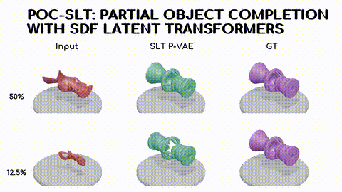

# POC-SLT: Partial Object Completion with SDF Latent Transformers
[](https://crv.pubpub.org/pub/yanc7d1w)
[](https://cgtuebingen.github.io/poc-slt/)

**Authors**: Faezeh Zakeri, Raphael Braun, Lukas Ruppert, and Hendrik P.A. Lensch

**Conference**: [CRV 2025](https://crv.pubpub.org/pub/yanc7d1w)

**Arxiv**: [Arxiv 2024](https://arxiv.org/abs/2411.05419)

**Code Repository**: [poc-slt](https://github.com/cgtuebingen/poc-slt)

---

## Project Progress Checklist

- [ ] Release main codebase
- [ ] Add evaluation scripts
- [ ] Clean up and document configs
- [ ] Add license info
<!--- [ ] Upload Dataset LMDB-->
---

## Abstract

3D geometric shape completion hinges on representation learning and a deep understanding of geometric data. Without profound insights into the three-dimensional nature of the data, this task remains unattainable. Our work addresses this challenge of 3D shape completion given partial observations by proposing a transformer operating on a latent space representing Signed Distance Fields (SDFs). Instead of a monolithic volume, the SDF of an object is partitioned into smaller high-resolution patches leading to a sequence of latent codes. The approach relies on a smooth latent space encoding learned via a variational autoencoder (VAE), trained on millions of 3D patches. We employ an efficient masked autoencoder transformer to complete partial sequences into comprehensive shapes in latent space. Our approach is extensively evaluated on partial observations from ShapeNet and the ABC dataset where only fractions of the objects are given. The proposed POC-SLT architecture compares favorably with several baseline state-of-the-art methods, demonstrating a significant improvement in 3D shape completion, both qualitatively and quantitatively.

---

## Demo Gif
[For high quality video, click here!](https://cgtuebingen.github.io/poc-slt/)
<p align="center">
  
</p>
<!---->

## 📦 Model checkpoint
[Shape Completion on Shapenet](https://huggingface.co/zakeri68/poc-slt-shapenet-completion)

[Shape Completion on ABC](https://huggingface.co/zakeri68/poc-slt-abc-completion)

[Patchwise Variational Autoencoder (P-VAE) on Shapenet](https://huggingface.co/zakeri68/poc-slt-shapenet-p-vae)

## Project Structure

```bash
├── data/
├── src/
├── results/
├── requirements.txt
├── train.py
├── eval.py
└── README.md
```


## Citation

If you use this work, please cite it as:

```bibtex
@article{Zakeri2025POC,
  author  = {Zakeri, Faezeh and Braun, Raphael and Ruppert, Lukas and Lensch, Hendrik P.A.},
  title   = {POC-SLT: Partial Object Completion with SDF Latent Transformers},
  journal = {Proceedings of the Conference on Robots and Vision},
  year    = {2025},
  month   = {May 27},
  note    = {https://crv.pubpub.org/pub/yanc7d1w}
}
You can also find citation metadata files or by clicking **Cite this repository** on the right.
